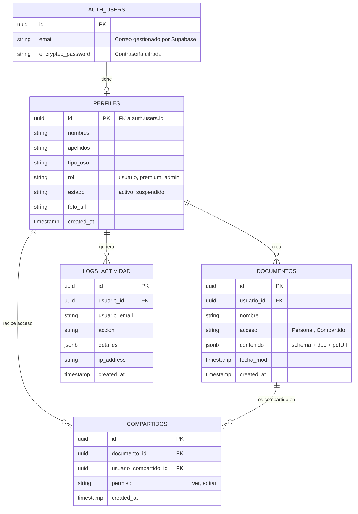
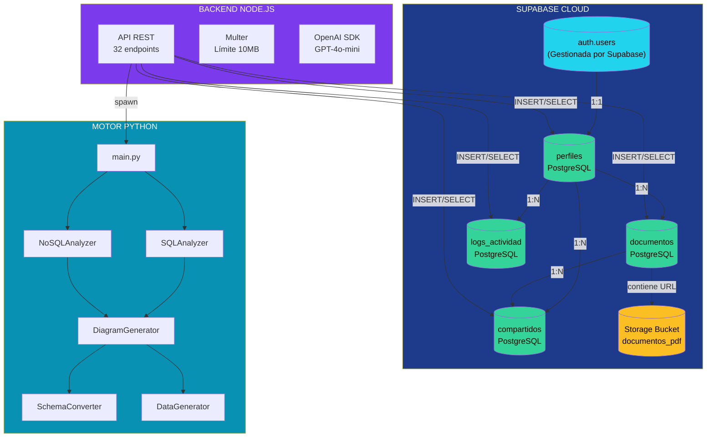

<center>

[comment]: 


**UNIVERSIDAD PRIVADA DE TACNA**

**FACULTAD DE INGENIERIA**

**Escuela Profesional de Ingeniería de Sistemas**

**Proyecto *Sistema de Documentación de Base de Datos***

Curso: *Base de Datos II*

Docente: *Mag. Patrick Cuadros Quiroga*

Integrantes:

***Andia Navarro, Diego Fabrizio (2022073906)***

***Quispe Chileno, Clara Briyith Mayra (2024080129)***

**Tacna – Perú**

***2026***

**  
**
</center>
<div style="page-break-after: always; visibility: hidden">\pagebreak</div>

|CONTROL DE VERSIONES||||||
| :-: | :- | :- | :- | :- | :- |
|Versión|Hecha por|Revisada por|Aprobada por|Fecha|Motivo|
|1\.0|DAN, CQC|DAN, CQC|DAN, CQC|04/07/2026|Versión Original|


# **INDICE GENERAL**

[1. Modelo Entidad / Relación](#modelo-entidad-relacion)

- [1.1. Diseño lógico](#11-diseno-logico)

- [1.2. Diseño Físico](#12-diseno-fisico)

[2. Diccionario de Datos](#diccionario-de-datos)

- [2.1. Tablas](#21-tablas)

- [2.2. Lenguaje de Definición de Datos (DDL)](#22-ddl)

[3. Base de Datos NoSQL (MongoDB) - Motor de Análisis Python](#base-datos-nosql)

- [3.1. Descripción del modelo NoSQL](#31-descripcion-nosql)

- [3.2. Colecciones](#32-colecciones)

- [3.3. Estructura de Documentos](#33-estructura-documentos)

- [3.4. Índices](#34-indices)

- [3.5. CRUD en MongoDB](#35-crud-mongodb)

[4. Almacenamiento de Archivos (Storage)](#almacenamiento-storage)

[5. Estructura de la API REST](#api-rest)

[6. Reglas de Integridad y Restricciones](#reglas-integridad)

[7. Conclusiones](#conclusiones)

---

**Índice de Figuras**

| **Figura** | **Descripción** | **Página** |
| :- | :- | :- |
| Figura 1 | Diseño Lógico de la Base de Datos del Sistema DataScript AI | |
| Figura 2 | Diseño Físico de la Base de Datos del Sistema DataScript AI | |

**Índice de Tablas**

| **Tabla** | **Descripción** | **Página** |
| :- | :- | :- |
| Tabla 1 | Estructura de la tabla auth.users (Supabase Auth) | |
| Tabla 2 | Estructura de la tabla perfiles | |
| Tabla 3 | Estructura de la tabla documentos | |
| Tabla 4 | Estructura de la tabla compartidos | |
| Tabla 5 | Estructura de la tabla logs_actividad | |
| Tabla 6 | Colección de la base de datos del motor de análisis (esquema JSON) | |
| Tabla 7 | Estructura de la colección de tablas analizadas | |
| Tabla 8 | Estructura de la colección de relaciones | |
| Tabla 9 | Bucket de almacenamiento documentos_pdf | |
| Tabla 10 | Endpoints de la API REST | |
| Tabla 11 | Reglas de integridad | |

---

<span id="modelo-entidad-relacion"></span>
## 1. Modelo Entidad / Relación

<span id="11-diseno-logico"></span>
### 1.1. Diseño lógico

El modelo de datos del sistema DataScript AI está compuesto por cuatro tablas principales gestionadas mediante Supabase (PostgreSQL), las cuales soportan la autenticación de usuarios, el almacenamiento de documentación generada, la compartición entre usuarios y el registro de auditoría de actividades. Adicionalmente, el motor de análisis Python produce una estructura JSON dinámica a partir de los esquemas de terceros cargados por los usuarios.

**Figura 1**
*Diseño Lógico de la Base de Datos del Sistema DataScript AI*



*Nota. Elaboración Propia.*

<span id="12-diseno-fisico"></span>
### 1.2. Diseño Físico

El sistema se despliega sobre Supabase, que proporciona una instancia de PostgreSQL 15 con extensiones como `pgcrypto` para generación de UUIDs y `pg_net` para comunicación asíncrona. Las tablas del sistema utilizan la cláusula `WITH (OIDS=FALSE)` y el motor de almacenamiento por defecto de PostgreSQL. Los índices son gestionados automáticamente por las restricciones PRIMARY KEY y UNIQUE, complementados por índices en las claves foráneas para optimizar las consultas de JOIN.

**Figura 2**
*Diseño Físico de la Base de Datos del Sistema DataScript AI*



*Nota. Elaboración Propia.*

<span id="diccionario-de-datos"></span>
## 2. Diccionario de Datos

<span id="21-tablas"></span>
### 2.1. Tablas

**Tabla 1**
*Estructura de la tabla auth.users (Supabase Auth)*

| **Nombre de la Tabla:** | auth.users |
| :- | :- |
| **Descripción de la Tabla:** | Tabla gestionada internamente por Supabase Auth. Almacena las credenciales de autenticación de los usuarios (correo electrónico y contraseña cifrada). Es la tabla base a la que `perfiles` se vincula mediante una relación 1 a 1. |
| **Objetivo:** | Proporcionar autenticación segura mediante JWT, Magic Link y proveedores OAuth, gestionando el ciclo de vida de las sesiones de usuario. |
| **Relaciones con otras Tablas:** | Relación 1:1 con la tabla `perfiles` a través del campo `id`. |

| **Nro.** | **Nombre del campo** | **Tipo dato longitud** | **Permite nulos** | **Clave primaria** | **Clave foránea** | **Descripción del campo** |
| :- | :- | :- | :- | :- | :- | :- |
| 1 | `id` | `uuid` | NO | SÍ | NO | Identificador único del usuario, generado por Supabase Auth. Se propaga a `perfiles.id` mediante un trigger `on_auth_user_created`. |
| 2 | `email` | `varchar(255)` | NO | NO | NO | Correo electrónico único del usuario, utilizado como identificador de inicio de sesión. |
| 3 | `encrypted_password` | `varchar(255)` | NO | NO | NO | Contraseña cifrada mediante el algoritmo bcrypt. Gestionada exclusivamente por Supabase. |
| 4 | `email_confirmed_at` | `timestamptz` | SÍ | NO | NO | Fecha y hora en que el usuario confirmó su correo electrónico (si la confirmación está habilitada). |
| 5 | `last_sign_in_at` | `timestamptz` | SÍ | NO | NO | Fecha y hora del último inicio de sesión exitoso. |
| 6 | `raw_app_meta_data` | `jsonb` | SÍ | NO | NO | Metadatos de la aplicación, incluyendo el proveedor de autenticación utilizado. |
| 7 | `raw_user_meta_data` | `jsonb` | SÍ | NO | NO | Metadatos del usuario proporcionados durante el registro (nombres, apellidos, tipo_uso). |
| 8 | `created_at` | `timestamptz` | NO | NO | NO | Fecha y hora de creación del registro. |
| 9 | `updated_at` | `timestamptz` | NO | NO | NO | Fecha y hora de la última actualización del registro. |

*Nota. Elaboración Propia.*

**Tabla 2**
*Estructura de la tabla perfiles del sistema*

| **Nombre de la Tabla:** | perfiles |
| :- | :- |
| **Descripción de la Tabla:** | Almacena la información de perfil de cada usuario registrado en el sistema, incluyendo datos personales, rol, estado de la cuenta y foto de perfil. |
| **Objetivo:** | Gestionar los datos personales de los usuarios, controlando su rol, estado y acceso a las funcionalidades del sistema según los permisos asignados. |
| **Relaciones con otras Tablas:** | Relación 1:1 con `auth.users` (el campo `id` es FK). Relación 1:N con `documentos`, `logs_actividad` y `compartidos`. |

| **Nro.** | **Nombre del campo** | **Tipo dato longitud** | **Permite nulos** | **Clave primaria** | **Clave foránea** | **Descripción del campo** |
| :- | :- | :- | :- | :- | :- | :- |
| 1 | `id` | `uuid` | NO | SÍ | SÍ (auth.users.id) | Identificador único del perfil. Se sincroniza con `auth.users` mediante un trigger `on_auth_user_created` que lo inserta automáticamente. |
| 2 | `nombres` | `varchar(100)` | NO | NO | NO | Nombre(s) del usuario registrado. |
| 3 | `apellidos` | `varchar(100)` | NO | NO | NO | Apellido(s) del usuario registrado. |
| 4 | `tipo_uso` | `varchar(50)` | SÍ | NO | NO | Tipo de cuenta del usuario. Valor por defecto: `'Personal'`. Describe el propósito de uso del sistema. |
| 5 | `rol` | `varchar(20)` | NO | NO | NO | Rol asignado al usuario. Valores permitidos: `'usuario'`, `'premium'`, `'admin'`. Controla el acceso a rutas protegidas y funcionalidades premium. |
| 6 | `estado` | `varchar(20)` | NO | NO | NO | Estado de la cuenta. Valores permitidos: `'activo'`, `'suspendido'`. Un usuario suspendido recibe HTTP 403 en todas las rutas protegidas. |
| 7 | `foto_url` | `text` | SÍ | NO | NO | URL de la foto de perfil del usuario, almacenada en Supabase Storage. |
| 8 | `created_at` | `timestamptz` | NO | NO | NO | Fecha y hora de creación del registro (asignada automáticamente mediante `DEFAULT now()`). |

*Nota. Elaboración Propia.*

**Tabla 3**
*Estructura de la tabla documentos del sistema*

| **Nombre de la Tabla:** | documentos |
| :- | :- |
| **Descripción de la Tabla:** | Almacena la documentación generada por los usuarios a partir del análisis de esquemas de bases de datos. Cada documento contiene el resultado completo del análisis en formato JSONB. |
| **Objetivo:** | Gestionar el almacenamiento, consulta y compartición de la documentación técnica generada automáticamente por el sistema. |
| **Relaciones con otras Tablas:** | Relación N:1 con `perfiles` (FK `usuario_id`). Relación 1:N con `compartidos`. |

| **Nro.** | **Nombre del campo** | **Tipo dato longitud** | **Permite nulos** | **Clave primaria** | **Clave foránea** | **Descripción del campo** |
| :- | :- | :- | :- | :- | :- | :- |
| 1 | `id` | `uuid` | NO | SÍ | NO | Identificador único del documento generado, asignado mediante `gen_random_uuid()`. |
| 2 | `usuario_id` | `uuid` | NO | NO | SÍ (auth.users.id) | Identificador del usuario propietario del documento. Se elimina en cascada si el usuario se elimina (`ON DELETE CASCADE`). |
| 3 | `nombre` | `varchar(255)` | NO | NO | NO | Nombre asignado al proyecto o documentación por el usuario. Se almacena tras aplicar `.trim()`. |
| 4 | `acceso` | `varchar(20)` | NO | NO | NO | Nivel de acceso del documento. Valores observados: `'Personal'`, `'Compartido'`. |
| 5 | `contenido` | `jsonb` | NO | NO | NO | Objeto JSON con el resultado completo del análisis. Incluye: `{ schema, documentation, diagram, pdfUrl }`. El esquema contiene tablas, campos, relaciones, vistas, triggers y procedimientos. |
| 6 | `fecha_mod` | `timestamptz` | SÍ | NO | NO | Fecha de la última modificación del documento. Se actualiza mediante la aplicación. |
| 7 | `created_at` | `timestamptz` | NO | NO | NO | Fecha y hora de creación del registro (asignada automáticamente). |

**Estructura típica del campo `contenido` (JSONB):**
```json
{
  "schema": {
    "tables": [{ "name": "usuarios", "columns": [...] }],
    "relations": [{ "from": "pedidos", "to": "usuarios", "type": "foreign_key" }],
    "views": [{ "name": "vista_ventas" }],
    "triggers": [{ "name": "trg_audit", "action": "BEFORE", "event": "INSERT", "table": "pedidos" }],
    "procedures": [{ "name": "sp_reporte", "parameters": "fecha date" }],
    "dialect": "mysql",
    "type": "sql"
  },
  "documentation": "## 1. ANÁLISIS GENERAL\n\n... (Markdown de 5-6 secciones)",
  "diagram": "erDiagram\n    USUARIOS ||--o{ PEDIDOS : tiene\n",
  "pdfUrl": "https://xxxx.supabase.co/storage/v1/object/public/documentos_pdf/user_xxx/1234567890_documentacion.pdf"
}
```

*Nota. Elaboración Propia.*

**Tabla 4**
*Estructura de la tabla compartidos del sistema*

| **Nombre de la Tabla:** | compartidos |
| :- | :- |
| **Descripción de la Tabla:** | Tabla intermedia que gestiona la compartición de documentos entre usuarios del sistema, permitiendo controlar los permisos de acceso (solo lectura o edición). |
| **Objetivo:** | Facilitar la colaboración entre usuarios mediante el intercambio controlado de documentación técnica, con trazabilidad de permisos. |
| **Relaciones con otras Tablas:** | Relación N:1 con `documentos` (FK `documento_id`). Relación N:1 con `auth.users` (FK `usuario_compartido_id`). |

| **Nro.** | **Nombre del campo** | **Tipo dato longitud** | **Permite nulos** | **Clave primaria** | **Clave foránea** | **Descripción del campo** |
| :- | :- | :- | :- | :- | :- | :- |
| 1 | `id` | `uuid` | NO | SÍ | NO | Identificador único del registro de compartición. |
| 2 | `documento_id` | `uuid` | NO | NO | SÍ (documentos.id) | Documento que se está compartiendo. Se elimina en cascada si el documento se elimina. |
| 3 | `usuario_compartido_id` | `uuid` | NO | NO | SÍ (auth.users.id) | Usuario con quien se comparte el documento. Se elimina en cascada si el usuario se elimina. |
| 4 | `permiso` | `varchar(10)` | NO | NO | NO | Nivel de permiso otorgado. Valores permitidos: `'ver'` (solo lectura), `'editar'` (lectura y escritura). Controlado por CHECK constraint. |
| 5 | `created_at` | `timestamptz` | NO | NO | NO | Fecha y hora en que se otorgó el acceso. |

**Restricciones adicionales:**
- `UNIQUE (documento_id, usuario_compartido_id)`: No se permite duplicar una compartición del mismo documento hacia el mismo usuario.
- `CHECK (permiso IN ('ver', 'editar'))`: Solo se permiten los valores definidos para el permiso.

*Nota. Elaboración Propia.*

**Tabla 5**
*Estructura de la tabla logs_actividad del sistema*

| **Nombre de la Tabla:** | logs_actividad |
| :- | :- |
| **Descripción de la Tabla:** | Registra todos los eventos relevantes de auditoría del sistema, incluyendo autenticación, registro de usuarios, carga de archivos, análisis y operaciones sobre documentos. |
| **Objetivo:** | Proveer un mecanismo de auditoría completo para el seguimiento y verificación de las operaciones realizadas por los usuarios, facilitando la detección de anomalías y el análisis de uso. |
| **Relaciones con otras Tablas:** | Relación N:1 con `auth.users` (FK `usuario_id`, puede ser nulo para eventos anónimos). |

| **Nro.** | **Nombre del campo** | **Tipo dato longitud** | **Permite nulos** | **Clave primaria** | **Clave foránea** | **Descripción del campo** |
| :- | :- | :- | :- | :- | :- | :- |
| 1 | `id` | `uuid` | NO | SÍ | NO | Identificador único del registro de auditoría. |
| 2 | `usuario_id` | `uuid` | SÍ | NO | SÍ (auth.users.id) | Usuario que originó la acción. Puede ser nulo para eventos anónimos o de API pública. Se establece a NULL si el usuario se elimina (`ON DELETE SET NULL`). |
| 3 | `usuario_email` | `varchar(255)` | SÍ | NO | NO | Correo electrónico del usuario al momento del evento (desnormalizado para consultas administrativas). |
| 4 | `accion` | `varchar(100)` | NO | NO | NO | Tipo de acción registrada. Valores observados: `'login'`, `'login_externo'`, `'registro_externo'`, `'guardar_documento_externo'`, `'upload_ai'`, `'upload_python'`, `'generate_data'`, `'convert'`, `'external_api_analyze'`. |
| 5 | `detalles` | `jsonb` | SÍ | NO | NO | Información adicional del evento en formato JSON. Ejemplo: `{ "agent": "Mozilla/5.0...", "fileName": "esquema.sql", "fileSize": 2048 }`. |
| 6 | `ip_address` | `varchar(45)` | SÍ | NO | NO | Dirección IP del cliente que originó la acción. Se normaliza desde formato IPv6 mapeado (`::ffff:192.168.1.1` → `192.168.1.1`). |
| 7 | `created_at` | `timestamptz` | NO | NO | NO | Fecha y hora del evento (asignada automáticamente). |

**Acciones registradas (campo `accion`):**

| **Valor** | **Descripción** |
| :- | :- |
| `login` | Inicio de sesión exitoso desde el frontend. |
| `login_externo` | Inicio de sesión desde la API externa (`POST /api/external/login`). |
| `registro_externo` | Creación de nueva cuenta desde la API externa. |
| `guardar_documento_externo` | Almacenamiento de un documento generado. |
| `upload_ai` | Carga de archivo para análisis con inteligencia artificial (OpenAI). |
| `upload_python` | Carga de archivo para análisis con el motor Python local. |
| `generate_data` | Generación de datos sintéticos de prueba. |
| `convert` | Conversión de esquema a otro formato. |
| `external_api_analyze` | Análisis realizado a través de la API pública (`POST /api/v1/analyze`). |

*Nota. Elaboración Propia.*

**Script de migración SQL (Supabase):**

```sql
-- Script de migración completo del sistema DataScript AI
DROP TABLE IF EXISTS public.compartidos CASCADE;
DROP TABLE IF EXISTS public.papelera CASCADE;
DROP TABLE IF EXISTS public.documentos CASCADE;
DROP TABLE IF EXISTS public.perfiles CASCADE;
DROP TABLE IF EXISTS public.logs_actividad CASCADE;

CREATE TABLE public.perfiles (
  id uuid NOT NULL,
  nombres text NULL,
  apellidos text NULL,
  tipo_uso text NULL,
  rol text NULL DEFAULT 'usuario'::text,
  estado text NULL DEFAULT 'activo'::text,
  foto_url text NULL,
  created_at timestamp with time zone NULL DEFAULT now(),
  CONSTRAINT perfiles_pkey PRIMARY KEY (id),
  CONSTRAINT perfiles_id_fkey FOREIGN KEY (id) REFERENCES auth.users (id) ON DELETE CASCADE,
  CONSTRAINT perfiles_rol_check CHECK (rol IN ('usuario', 'premium', 'admin')),
  CONSTRAINT perfiles_estado_check CHECK (estado IN ('activo', 'suspendido'))
);

CREATE TABLE public.documentos (
  id uuid NOT NULL DEFAULT gen_random_uuid(),
  usuario_id uuid NOT NULL,
  nombre text NOT NULL,
  acceso text NULL DEFAULT 'Personal'::text,
  fecha_mod timestamp with time zone NULL DEFAULT now(),
  created_at timestamp with time zone NULL DEFAULT now(),
  contenido jsonb NULL,
  CONSTRAINT documentos_pkey PRIMARY KEY (id),
  CONSTRAINT documentos_usuario_id_fkey FOREIGN KEY (usuario_id) REFERENCES auth.users (id) ON DELETE CASCADE
);

CREATE TABLE public.papelera (
  id uuid NOT NULL DEFAULT gen_random_uuid(),
  usuario_id uuid NOT NULL,
  nombre text NOT NULL,
  acceso text NULL,
  fecha_eliminacion timestamp with time zone NULL DEFAULT now(),
  created_at timestamp with time zone NULL DEFAULT now(),
  contenido jsonb NULL,
  CONSTRAINT papelera_pkey PRIMARY KEY (id),
  CONSTRAINT papelera_usuario_id_fkey FOREIGN KEY (usuario_id) REFERENCES auth.users (id) ON DELETE CASCADE
);

CREATE TABLE public.compartidos (
  id uuid NOT NULL DEFAULT gen_random_uuid(),
  documento_id uuid NOT NULL,
  usuario_compartido_id uuid NOT NULL,
  permiso text DEFAULT 'ver'::text,
  created_at timestamp with time zone DEFAULT now(),
  CONSTRAINT compartidos_pkey PRIMARY KEY (id),
  CONSTRAINT compartidos_documento_id_fkey FOREIGN KEY (documento_id) REFERENCES public.documentos (id) ON DELETE CASCADE,
  CONSTRAINT compartidos_usuario_compartido_fkey FOREIGN KEY (usuario_compartido_id) REFERENCES auth.users (id) ON DELETE CASCADE,
  CONSTRAINT compartidos_doc_user_unique UNIQUE (documento_id, usuario_compartido_id),
  CONSTRAINT compartidos_permiso_check CHECK (permiso IN ('ver', 'editar'))
);

CREATE TABLE public.logs_actividad (
  id uuid NOT NULL DEFAULT gen_random_uuid(),
  usuario_id uuid NULL,
  usuario_email text NULL,
  accion text NOT NULL,
  detalles jsonb NULL,
  ip_address text NULL,
  created_at timestamp with time zone DEFAULT now(),
  CONSTRAINT logs_actividad_pkey PRIMARY KEY (id),
  CONSTRAINT logs_actividad_usuario_id_fkey FOREIGN KEY (usuario_id) REFERENCES auth.users (id) ON DELETE SET NULL
);

-- Políticas de seguridad RLS
ALTER TABLE public.perfiles ENABLE ROW LEVEL SECURITY;
ALTER TABLE public.documentos ENABLE ROW LEVEL SECURITY;
ALTER TABLE public.compartidos ENABLE ROW LEVEL SECURITY;
ALTER TABLE public.logs_actividad ENABLE ROW LEVEL SECURITY;
```

<span id="22-ddl"></span>
### 2.2. Lenguaje de Definición de Datos (DDL)

El script DDL completo se encuentra definido en el archivo `supabase_schema.sql` del proyecto. A continuación se presenta el DDL extraído del sistema, correspondiente a la base de datos PostgreSQL gestionada por Supabase:

```sql
-- =============================================
-- SISTEMA DATASCRIPT AI - DDL COMPLETO
-- Base de datos: PostgreSQL 15 (Supabase)
-- =============================================

-- Extensión para UUIDs
CREATE EXTENSION IF NOT EXISTS "pgcrypto";

-- =============================================
-- TABLA: perfiles
-- =============================================
CREATE TABLE public.perfiles (
  id uuid NOT NULL,
  nombres text NULL,
  apellidos text NULL,
  tipo_uso text NULL,
  rol text NULL DEFAULT 'usuario'::text,
  estado text NULL DEFAULT 'activo'::text,
  foto_url text NULL,
  created_at timestamp with time zone NULL DEFAULT now(),
  CONSTRAINT perfiles_pkey PRIMARY KEY (id),
  CONSTRAINT perfiles_id_fkey FOREIGN KEY (id) REFERENCES auth.users (id) ON DELETE CASCADE,
  CONSTRAINT perfiles_rol_check CHECK (rol IN ('usuario', 'premium', 'admin')),
  CONSTRAINT perfiles_estado_check CHECK (estado IN ('activo', 'suspendido'))
);
CREATE INDEX idx_perfiles_rol ON public.perfiles USING btree (rol);
CREATE INDEX idx_perfiles_estado ON public.perfiles USING btree (estado);

-- Trigger para crear perfil automáticamente al registrarse
CREATE OR REPLACE FUNCTION public.handle_new_user()
RETURNS trigger AS $$
BEGIN
  INSERT INTO public.perfiles (id, nombres, apellidos, tipo_uso, rol, estado)
  VALUES (
    NEW.id,
    NEW.raw_user_meta_data->>'nombres',
    NEW.raw_user_meta_data->>'apellidos',
    COALESCE(NEW.raw_user_meta_data->>'tipo_uso', 'Personal'),
    'usuario',
    'activo'
  );
  RETURN NEW;
END;
$$ LANGUAGE plpgsql SECURITY DEFINER;

CREATE OR REPLACE TRIGGER on_auth_user_created
  AFTER INSERT ON auth.users
  FOR EACH ROW EXECUTE FUNCTION public.handle_new_user();

-- =============================================
-- TABLA: documentos
-- =============================================
CREATE TABLE public.documentos (
  id uuid NOT NULL DEFAULT gen_random_uuid(),
  usuario_id uuid NOT NULL,
  nombre text NOT NULL,
  acceso text NULL DEFAULT 'Personal'::text,
  fecha_mod timestamp with time zone NULL DEFAULT now(),
  created_at timestamp with time zone NULL DEFAULT now(),
  contenido jsonb NULL,
  CONSTRAINT documentos_pkey PRIMARY KEY (id),
  CONSTRAINT documentos_usuario_id_fkey FOREIGN KEY (usuario_id) REFERENCES auth.users (id) ON DELETE CASCADE
);
CREATE INDEX idx_documentos_usuario ON public.documentos USING btree (usuario_id);
CREATE INDEX idx_documentos_acceso ON public.documentos USING btree (acceso);
CREATE INDEX idx_documentos_contenido_gin ON public.documentos USING gin (contenido jsonb_path_ops);

-- =============================================
-- TABLA: papelera (soft delete)
-- =============================================
CREATE TABLE public.papelera (
  id uuid NOT NULL DEFAULT gen_random_uuid(),
  usuario_id uuid NOT NULL,
  nombre text NOT NULL,
  acceso text NULL,
  fecha_eliminacion timestamp with time zone NULL DEFAULT now(),
  created_at timestamp with time zone NULL DEFAULT now(),
  contenido jsonb NULL,
  CONSTRAINT papelera_pkey PRIMARY KEY (id),
  CONSTRAINT papelera_usuario_id_fkey FOREIGN KEY (usuario_id) REFERENCES auth.users (id) ON DELETE CASCADE
);

-- =============================================
-- TABLA: compartidos
-- =============================================
CREATE TABLE public.compartidos (
  id uuid NOT NULL DEFAULT gen_random_uuid(),
  documento_id uuid NOT NULL,
  usuario_compartido_id uuid NOT NULL,
  permiso text DEFAULT 'ver'::text,
  created_at timestamp with time zone DEFAULT now(),
  CONSTRAINT compartidos_pkey PRIMARY KEY (id),
  CONSTRAINT compartidos_documento_id_fkey FOREIGN KEY (documento_id) REFERENCES public.documentos (id) ON DELETE CASCADE,
  CONSTRAINT compartidos_usuario_compartido_fkey FOREIGN KEY (usuario_compartido_id) REFERENCES auth.users (id) ON DELETE CASCADE,
  CONSTRAINT compartidos_doc_user_unique UNIQUE (documento_id, usuario_compartido_id),
  CONSTRAINT compartidos_permiso_check CHECK (permiso IN ('ver', 'editar'))
);
CREATE INDEX idx_compartidos_documento ON public.compartidos USING btree (documento_id);
CREATE INDEX idx_compartidos_usuario ON public.compartidos USING btree (usuario_compartido_id);

-- =============================================
-- TABLA: logs_actividad
-- =============================================
CREATE TABLE public.logs_actividad (
  id uuid NOT NULL DEFAULT gen_random_uuid(),
  usuario_id uuid NULL,
  usuario_email text NULL,
  accion text NOT NULL,
  detalles jsonb NULL,
  ip_address text NULL,
  created_at timestamp with time zone DEFAULT now(),
  CONSTRAINT logs_actividad_pkey PRIMARY KEY (id),
  CONSTRAINT logs_actividad_usuario_id_fkey FOREIGN KEY (usuario_id) REFERENCES auth.users (id) ON DELETE SET NULL
);
CREATE INDEX idx_logs_usuario ON public.logs_actividad USING btree (usuario_id);
CREATE INDEX idx_logs_accion ON public.logs_actividad USING btree (accion);
CREATE INDEX idx_logs_created_at ON public.logs_actividad USING btree (created_at DESC);

-- =============================================
-- POLÍTICAS DE SEGURIDAD RLS
-- =============================================
ALTER TABLE public.perfiles ENABLE ROW LEVEL SECURITY;
ALTER TABLE public.documentos ENABLE ROW LEVEL SECURITY;
ALTER TABLE public.papelera ENABLE ROW LEVEL SECURITY;
ALTER TABLE public.compartidos ENABLE ROW LEVEL SECURITY;
ALTER TABLE public.logs_actividad ENABLE ROW LEVEL SECURITY;

-- Política: usuarios solo ven su propio perfil
CREATE POLICY "Usuarios ven su propio perfil"
  ON public.perfiles FOR SELECT
  USING (auth.uid() = id);

-- Política: usuarios solo ven sus propios documentos
CREATE POLICY "Usuarios ven sus propios documentos"
  ON public.documentos FOR SELECT
  USING (auth.uid() = usuario_id);

-- Política: usuarios ven documentos compartidos con ellos
CREATE POLICY "Usuarios ven documentos compartidos"
  ON public.documentos FOR SELECT
  USING (
    auth.uid() IN (
      SELECT usuario_compartido_id
      FROM public.compartidos
      WHERE documento_id = id
    )
  );

-- Política: admins pueden ver todos los logs
CREATE POLICY "Admins ven todos los logs"
  ON public.logs_actividad FOR SELECT
  USING (
    EXISTS (
      SELECT 1 FROM public.perfiles
      WHERE id = auth.uid() AND rol = 'admin'
    )
  );
```

<span id="base-datos-nosql"></span>
## 3. Base de Datos NoSQL (MongoDB) - Motor de Análisis Python

<span id="31-descripcion-nosql"></span>
### 3.1. Descripción del modelo NoSQL

A diferencia de un sistema tradicional con MongoDB, el motor de análisis Python de DataScript AI (`python_analyzer/`) produce una estructura de datos JSON estandarizada que sigue un modelo orientado a documentos. Este modelo permite manejar información flexible y dinámica, ideal para representar esquemas de bases de datos de terceros con estructuras variables.

La estructura JSON generada por el motor de análisis se denomina internamente como `analysis result` y sigue el siguiente esquema:

**Documento raíz:** `schema_result`

<span id="32-colecciones"></span>
### 3.2. Colecciones

**Tabla 6**
*Colección de la base de datos del motor de análisis (esquema JSON)*

| **Colección** | **Descripción** |
| :- | :- |
| `tables` | Lista de tablas o colecciones detectadas en el esquema analizado. Es el núcleo del análisis. |
| `relations` | Lista de relaciones entre tablas detectadas, tanto explícitas como implícitas. |
| `anomalies` | Lista de anomalías estructurales detectadas durante el análisis. |
| `metrics` | Métricas calculadas del esquema: normalización, total de tablas, total de columnas. |

*Nota. Elaboración Propia.*

<span id="33-estructura-documentos"></span>
### 3.3. Estructura de Documentos

**Tabla 7**
*Estructura de la colección de tablas analizadas*

| **Campo** | **Tipo de dato** | **Descripción** |
| :- | :- | :- |
| `name` | `string` | Nombre de la tabla o colección detectada en el esquema. |
| `columns` | `array` | Lista de columnas que componen la tabla. Cada columna incluye `name`, `type`, `nullable`, `primaryKey`, `autoIncrement`. |
| `foreignKeys` | `array` | Lista de claves foráneas explícitas detectadas. Cada FK incluye `column`, `referencesTable`, `referencesColumn`. |
| `type` | `string` | Tipo de esquema: `'sql'`, `'json'`, `'nosql'`, `'excel'`. |
| `dialect` | `string` | Dialecto SQL detectado: `'mysql'`, `'postgres'`, `'sqlite'`, `'sqlserver'`. Solo aplica para archivos SQL. |

*Nota. Elaboración Propia.*

**Tabla 8**
*Estructura de la colección de relaciones*

| **Campo** | **Tipo de dato** | **Descripción** |
| :- | :- | :- |
| `from` | `string` | Nombre de la tabla origen de la relación. |
| `to` | `string` | Nombre de la tabla destino de la relación. |
| `type` | `string` | Tipo de relación: `'foreign_key'` (explícita) o `'implicit'` (implícita por fuzzy matching). |
| `column` | `string` | Nombre de la columna FK en la tabla origen. |
| `referencesColumn` | `string` | Nombre de la columna PK en la tabla destino. |

**Ejemplo de documento JSON generado por el motor:**

```json
{
  "fileName": "esquema_ventas.sql",
  "fileType": ".sql",
  "success": true,
  "analysis": {
    "schema": {
      "tables": [
        {
          "name": "usuarios",
          "columns": [
            { "name": "id", "type": "INT", "nullable": false, "primaryKey": true, "autoIncrement": true },
            { "name": "email", "type": "VARCHAR(100)", "nullable": false, "primaryKey": false, "autoIncrement": false },
            { "name": "nombre", "type": "VARCHAR(50)", "nullable": true, "primaryKey": false, "autoIncrement": false }
          ],
          "foreignKeys": []
        },
        {
          "name": "pedidos",
          "columns": [
            { "name": "id", "type": "INT", "nullable": false, "primaryKey": true, "autoIncrement": true },
            { "name": "usuario_id", "type": "INT", "nullable": false, "primaryKey": false, "autoIncrement": false },
            { "name": "total", "type": "DECIMAL(10,2)", "nullable": false, "primaryKey": false, "autoIncrement": false }
          ],
          "foreignKeys": [
            { "column": "usuario_id", "referencesTable": "usuarios", "referencesColumn": "id" }
          ]
        }
      ],
      "relations": [
        { "from": "pedidos", "to": "usuarios", "type": "foreign_key", "column": "usuario_id", "referencesColumn": "id" }
      ],
      "dialect": "mysql",
      "type": "sql"
    },
    "metrics": {
      "normalizationScore": 85,
      "totalTables": 2,
      "totalColumns": 5
    },
    "anomalies": [
      { "type": "optimization", "severity": "medium", "table": "pedidos", "message": "No se detectaron índices en campos de búsqueda frecuente." }
    ],
    "diagram": "erDiagram\n    usuarios ||--o{ pedidos : tiene\n",
  "conversions": {
      "postgresql": "CREATE TABLE usuarios (...)",
      "mongodb": "const usuarioSchema = new Schema({...})",
      "prisma": "model Usuario { ... }"
    }
  }
```

*Nota. Elaboración Propia.*

<span id="34-indices"></span>
### 3.4. Índices

En el contexto del motor de análisis Python, los "índices" corresponden a las detecciones que realiza el analizador sobre los esquemas procesados. MongoDB crea automáticamente un índice primario en `_id`. Para el motor de análisis, se recomienda la siguiente estructura de índices lógicos sobre las colecciones de datos analizados:

| **Campo / Combinación** | **Tipo** | **Propósito** |
| :- | :- | :- |
| `tables[].name` | Index simple | Acelera la búsqueda de tablas por nombre dentro del esquema analizado. |
| `tables[].columns[].name` | Index simple | Optimiza la identificación de columnas específicas en el análisis. |
| `relations[].from` + `relations[].to` | Index compuesto | Acelera la detección de relaciones entre tablas específicas. |
| `dialect` | Index simple | Mejora el filtrado de esquemas por dialecto SQL. |

*Nota. Elaboración Propia.*

<span id="35-crud-mongodb"></span>
### 3.5. CRUD en MongoDB

El motor de análisis Python no realiza operaciones CRUD sobre MongoDB, sino que **produce documentos JSON** que luego son almacenados en Supabase (tabla `documentos`, campo `contenido`). Sin embargo, el módulo `schema_converter.py` puede transformar el esquema analizado a una estructura equivalente de MongoDB (Mongoose Schema) para su uso en aplicaciones que requieran este formato.

**Ejemplo de conversión a Mongoose Schema (generado por SchemaConverter):**

```javascript
// Esquema generado automáticamente por SchemaConverter
const mongoose = require('mongoose');

const { Schema } = mongoose;

const usuariosSchema = new Schema({
  id: { type: Number, required: true },
  email: { type: String, required: true },
  nombre: { type: String, required: false }
}, { timestamps: true });

const pedidosSchema = new Schema({
  id: { type: Number, required: true },
  usuario_id: { type: Number, required: true, ref: 'usuarios' },
  total: { type: Number, required: true }
}, { timestamps: true });

module.exports = {
  Usuarios: mongoose.model('usuarios', usuariosSchema),
  Pedidos: mongoose.model('pedidos', pedidosSchema)
};
```

**Ejemplo de consulta de datos analizados desde Supabase:**

```javascript
// Consultar documentos analizados desde el frontend
const { data: documentos, error } = await supabaseClient
  .from('documentos')
  .select('contenido')
  .eq('usuario_id', userId);

// Acceder al esquema analizado
const schema = documentos[0].contenido.schema;
console.log(`Tablas detectadas: ${schema.tables.length}`);
console.log(`Relaciones detectadas: ${schema.relations.length}`);
```

<span id="almacenamiento-storage"></span>
## 4. Almacenamiento de Archivos (Storage)

**Tabla 9**
*Bucket de almacenamiento documentos_pdf*

| **Nombre del Bucket:** | documentos_pdf |
| :- | :- |
| **Descripción:** | Almacena los archivos PDF exportados de la documentación generada por cada usuario. |
| **Objetivo:** | Proporcionar almacenamiento persistente y público para los PDFs de documentación, accesibles mediante URL pública generada por Supabase Storage. |
| **Relaciones:** | Vinculado a la tabla `documentos` mediante el campo `contenido.pdfUrl`. |

| **Nro.** | **Propiedad** | **Valor** | **Descripción** |
| :- | :- | :- | :- |
| 1 | `Bucket ID` | `documentos_pdf` | Identificador único del bucket en Supabase Storage. |
| 2 | `Visibilidad` | Público | Los archivos son accesibles mediante URL pública sin autenticación adicional. |
| 3 | `Ruta de archivo` | `user_{userId}/{timestamp}_documentacion.pdf` | Patrón de ruta que organiza los PDFs por usuario y timestamp. |
| 4 | `Tipo de contenido` | `application/pdf` | Tipo MIME de los archivos almacenados. |
| 5 | `Tamaño máximo` | 10 MB (limitado por Multer en el backend) | Los archivos mayores a 10 MB son rechazados antes de llegar a Storage. |
| 6 | `URL pública` | `https://{supabase_url}/storage/v1/object/public/documentos_pdf/{ruta}` | URL generada mediante `getPublicUrl()`. |

**Flujo de almacenamiento:**

1. El usuario genera documentación desde el frontend.
2. El frontend exporta a PDF usando `html2pdf.js` o `jsPDF` en el navegador.
3. El PDF en base64 se envía al endpoint `POST /api/external/documentos`.
4. El servidor Node.js decodifica el base64, construye la ruta `user_{userId}/{timestamp}_documentacion.pdf`.
5. El servidor sube el archivo mediante `supabase.storage.from('documentos_pdf').upload(filePath, pdfBuffer)`.
6. Se obtiene la URL pública mediante `getPublicUrl()` y se almacena en `contenido.pdfUrl`.

*Nota. Elaboración Propia.*

<span id="api-rest"></span>
## 5. Estructura de la API REST

**Tabla 10**
*Endpoints de la API REST del sistema*

| **Nro.** | **Grupo** | **Endpoint** | **Método** | **Descripción** | **Backend** |
| :- | :- | :- | :- | :- | :- |
| 1 | Cliente Web | `/` | GET | Sirve la landing page (`index.html`). | Express static |
| 2 | Cliente Web | `/api-docs` | GET | Sirve documentación interactiva de la API en OpenAPI. | Express static |
| 3 | Cliente Web | `/jspdf.js` | GET | Sirve la librería jsPDF desde node_modules. | Express static |
| 4 | Cliente Web | `/api/skills` | GET | Devuelve el manifiesto de habilidades de IA registradas. | fs.readFileSync |
| 5 | Análisis IA | `/upload` | POST | Carga archivo → parsea (SQL/JSON/XLSX) → envía a OpenAI → devuelve documentación Markdown. | OpenAI SDK |
| 6 | Análisis IA | `/test-openai` | GET | Envía mensaje de prueba a GPT-3.5-turbo para verificar API Key. | OpenAI SDK |
| 7 | Proxy Python | `/analyze-python` | POST | Carga archivo → spawn Python local o proxy Vercel → devuelve análisis completo. | python_analyzer |
| 8 | Proxy Python | `/convert` | POST | Envía schema + targetFormat → SchemaConverter → código convertido (11 formatos). | SchemaConverter |
| 9 | Proxy Python | `/generate-data` | POST | Envía schema → DataGenerator (Faker) → datos sintéticos (SQL o JSON). | DataGenerator |
| 10 | Admin | `/api/admin/users` | GET | Lista perfiles + emails (vía Auth) + conteo documentos. | Supabase Admin |
| 11 | Admin | `/api/admin/users` | POST | Crea usuario en Auth (`email_confirm: true`) + upsert en perfiles. | Supabase Admin |
| 12 | Admin | `/api/admin/users/:id` | PUT | Actualiza perfil + sincroniza Auth (`updateUserById`). | Supabase Admin |
| 13 | Admin | `/api/admin/users/:id` | DELETE | Elimina usuario de Auth + perfiles. | Supabase Admin |
| 14 | Admin | `/api/admin/logs` | GET | Lista logs_actividad ordenados por fecha descendente. | Supabase query |
| 15 | Admin | `/api/admin/metrics` | GET | Cuenta total usuarios, documentos, compartidos y logs. | Supabase count |
| 16 | API Ext | `/api/external/login` | POST | Autentica con email+password, devuelve id+rol+nombres. | Supabase Auth |
| 17 | API Ext | `/api/external/autologin` | GET | Genera Magic Link y redirige a Supabase. | Supabase Admin |
| 18 | API Ext | `/api/external/register` | POST | Crea cuenta (signUp) + inserta perfil. | Supabase Auth |
| 19 | API Ext | `/api/external/documentos` | POST | Guarda documento + sube PDF a Storage + registra log. | Supabase Storage |
| 20 | API Ext | `/api/v1/analyze` | POST | API pública: archivo → Python → Markdown → PDF (JSON o binario). | python_analyzer |

*Nota. Elaboración Propia.*

<span id="reglas-integridad"></span>
## 6. Reglas de Integridad y Restricciones

**Tabla 11**
*Reglas de integridad del sistema*

| **Código** | **Regla** | **Descripción** | **Implementación** |
| :- | :- | :- | :- |
| RI-01 | Integridad referencial en `documentos.usuario_id` | Todo documento debe pertenecer a un usuario existente en `auth.users`. | `FOREIGN KEY (usuario_id) REFERENCES auth.users(id) ON DELETE CASCADE` |
| RI-02 | Integridad referencial en `compartidos` | Toda compartición debe referenciar un documento y un usuario válidos. | FK dual: `documento_id → documentos.id`, `usuario_compartido_id → auth.users.id`, ambos `ON DELETE CASCADE` |
| RI-03 | Unicidad de compartición | No puede existir más de un registro de compartidos para el mismo par `(documento_id, usuario_compartido_id)`. | `UNIQUE (documento_id, usuario_compartido_id)`; error code 23505 gestionado en frontend |
| RI-04 | Roles controlados | El campo `rol` de perfiles solo admite `'usuario'`, `'premium'`, `'admin'`. | `CHECK (rol IN ('usuario', 'premium', 'admin'))` + verificación en server.js (`verificarUsuario`) |
| RI-05 | Estado de cuenta | El campo `estado` de perfiles solo admite `'activo'` y `'suspendido'`. | `CHECK (estado IN ('activo', 'suspendido'))` + middleware que retorna HTTP 403 si está suspendido |
| RI-06 | Confidencialidad de credenciales | Las credenciales de autenticación no se almacenan en `perfiles`, sino exclusivamente en `auth.users` de Supabase. | La tabla perfiles solo contiene datos personales; el login usa Supabase Auth SDK |
| RI-07 | Archivos temporales efímeros | Los archivos cargados por el usuario se eliminan del servidor tras el procesamiento. | `fs.unlinkSync()` inmediatamente después de ejecutar el análisis, desde `os.tmpdir()` |
| RI-08 | Límite de tamaño de archivo | El sistema rechaza archivos mayores a 10 MB. | `limits: { fileSize: 10 * 1024 * 1024 }` en configuración de Multer |
| RI-09 | Solo lectura sobre BD analizadas | El sistema no ejecuta operaciones DML ni DDL sobre las bases de datos analizadas. | Validación en `verificarUsuario()`; ningún endpoint ejecuta INSERT/UPDATE/DELETE sobre esquemas externos |
| RI-10 | Acceso restringido a usuarios autenticados | Todas las funcionalidades están restringidas a usuarios autenticados. | Middleware JWT en Supabase Auth + verificación de token en cada solicitud |

**Manejo de errores HTTP:**

| **Código HTTP** | **Escenario** | **Respuesta JSON** |
| :- | :- | :- |
| 400 | Archivo demasiado grande, formato no soportado, datos inválidos | `{ "error": "mensaje descriptivo" }` |
| 401 | Token de autenticación no proporcionado | `{ "error": "No autorizado. Se requiere x-admin-id" }` |
| 403 | Usuario suspendido, rol no autorizado | `{ "error": "Tu cuenta ha sido suspendida. Contacta al administrador." }` |
| 404 | Recurso no encontrado | `{ "error": "Archivo no encontrado" }` |
| 500 | Error interno del servidor, timeout de servicios externos | `{ "error": "Error interno del servidor: [mensaje]" }` |

*Nota. Elaboración Propia.*

<span id="conclusiones"></span>
## 7. Conclusiones

El presente diccionario de datos documenta de manera completa y estructurada la arquitectura de almacenamiento del Sistema de Documentación de Base de Datos (DataScript AI), compuesta por:

- **Cuatro tablas transaccionales** gestionadas mediante Supabase PostgreSQL: `perfiles` (con vinculación 1:1 a `auth.users`), `documentos` (con contenido JSONB), `compartidos` (con permisos ver/editar) y `logs_actividad` (con trazabilidad completa de auditoría).
- **Una tabla auxiliar** `papelera` para la gestión de eliminación de documentos.
- **Un bucket de almacenamiento** `documentos_pdf` en Supabase Storage para la persistencia de archivos PDF generados.
- **Un motor de análisis Python** modular compuesto por 5 analizadores especializados (SQL, NoSQL, Diagramas, Conversión, Datos) que produce una estructura JSON estandarizada a partir de esquemas de bases de datos de terceros.
- **20 endpoints REST** documentados que exponen la funcionalidad del sistema a través de 5 grupos: Cliente Web, Análisis IA, Proxy Python, Administración y API Externa.

El DDL completo del sistema, incluyendo las políticas de seguridad Row Level Security (RLS), los triggers de creación automática de perfiles y los CHECK constraints para roles y estados, proporciona una base sólida para la integridad referencial y la seguridad de los datos.

Mantener actualizado este documento es fundamental para garantizar la mantenibilidad del sistema ante la incorporación de nuevas funcionalidades, como el versionado de documentación, el soporte de nuevos formatos de análisis o la ampliación de los endpoints de la API REST.
